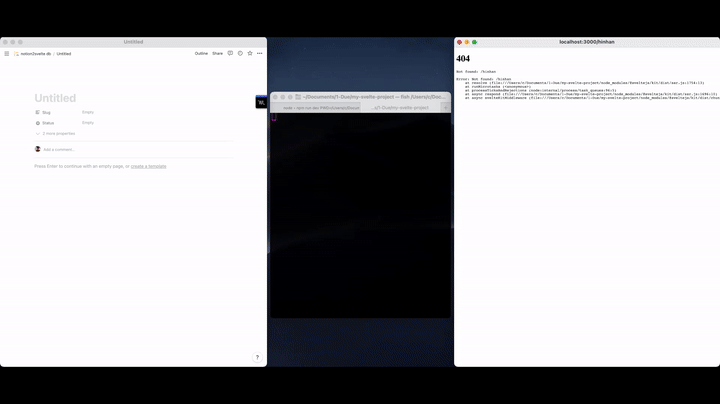
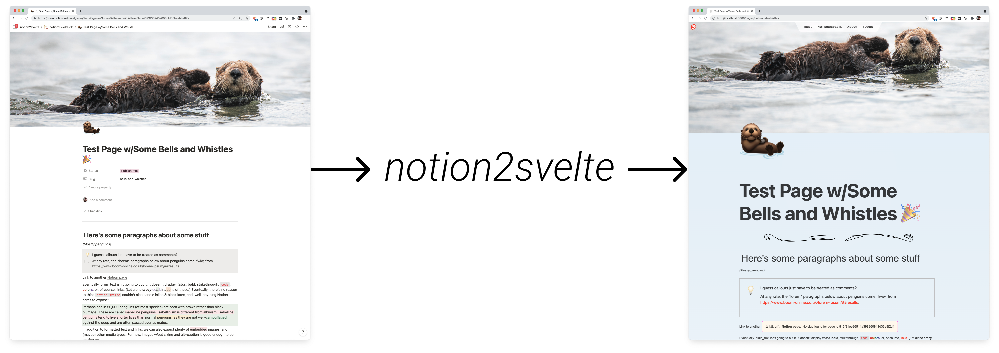

<!-- PROJECT SHIELDS -->
<!-- [![Contributors][contributors-shield]][contributors-url] -->
<!-- [![Forks][forks-shield]][forks-url] -->

[![Stargazers][stars-shield]][stars-url]
[![Issues][issues-shield]][issues-url]
[![MIT License][license-shield]][license-url]

<!-- PROJECT LOGO -->
 

  

  <h3 align="center">@nvlgzr/notion2svelte (n2s)</h3>

  

    Fetches pages from Notion and renders them as .svelte files
  

  

    <a href="https://notion2svelte.vercel.app/"><strong>Explore the docs »</strong></a>
     
     
    <a href="https://github.com/nvlgzr/notion2svelte/issues">Report a Bug</a>
    ֍
    <a href="https://github.com/nvlgzr/notion2svelte/discussions/1">Request a Feature</a>
    ֍
    <a href="https://github.com/nvlgzr/notion2svelte/discussions/1">Say Hi</a>
  

<!-- ABOUT THE PROJECT -->

## Summary

Presumably if you're reading this, you don't need convincing that Notion.so is one of the most pleasant ways to express your thoughts through your fingertips. And presumably you also need no convincing when it comes to choosing SvelteKit (or at least Svelte) as your tool of choice for wrangling HTML, CSS, and (sometimes) JS. If you _do_ need convincing, try [this](https://www.google.com/search?q=why+i+love+svelte&rlz=1C5CHFA_enUS824US824&oq=why+i+love+svelte&aqs=chrome..69i57j33i22i29i30.2331j0j7&sourceid=chrome&ie=UTF-8) and [this](https://www.google.com/search?q=why+i+love+notion&rlz=1C5CHFA_enUS824US824&ei=cXimYbmsMJW70PEPtc6GmAI&ved=0ahUKEwj5qNma5sD0AhWVHTQIHTWnASMQ4dUDCA8&uact=5&oq=why+i+love+notion&gs_lcp=Cgdnd3Mtd2l6EAMyBQgAEIAEOgcIABBHELADOgUILhCABDoGCAAQFhAeSgQIQRgAUK8NWN0RYNgUaAJwAngAgAFhiAHmA5IBATaYAQCgAQHIAQjAAQE&sclient=gws-wiz).

So the basic goal is clear:

- Write pages in Notion
- Run notion2svelte
- Magically see that page content appear in your Svelte app

  

For more about what sets _notion2svelte_ apart, how it works, etc., here's [a high level overview](https://notion2svelte.vercel.app/pages/about-notion2svelte).

<!-- GETTING STARTED -->

## Getting Started

The premise is simple: point _notion2svelte_ at the database of your choice, and watch as it spits working _.svelte_ files into your existing project. Still, this is early days, so the experience is far from optimized.

With that caveat firmly on the table, here's [_notion2svelte_ in 10 minutes](https://www.youtube.com/watch?v=xvV8-R_uUHg&t=12s).

(<a href="#top">back to top</a>)

<!-- LICENSE -->

## License

Distributed under the [MIT License](LICENSE).

(<a href="#top">back to top</a>)

<!-- MARKDOWN LINKS & IMAGES -->
<!-- https://www.markdownguide.org/basic-syntax/#reference-style-links -->

[contributors-shield]: https://img.shields.io/github/contributors/nvlgzr/notion2svelte.svg?style=for-the-badge
[contributors-url]: https://github.com/nvlgzr/notion2svelte/graphs/contributors
[forks-shield]: https://img.shields.io/github/forks/nvlgzr/notion2svelte.svg?style=for-the-badge
[forks-url]: https://github.com/nvlgzr/notion2svelte/network/members
[stars-shield]: https://img.shields.io/github/stars/nvlgzr/notion2svelte.svg?style=for-the-badge
[stars-url]: https://github.com/nvlgzr/notion2svelte/stargazers
[issues-shield]: https://img.shields.io/github/issues/nvlgzr/notion2svelte.svg?style=for-the-badge
[issues-url]: https://github.com/nvlgzr/notion2svelte/issues
[license-shield]: https://img.shields.io/github/license/nvlgzr/notion2svelte.svg?style=for-the-badge
[license-url]: https://github.com/nvlgzr/notion2svelte/blob/main/LICENSE
